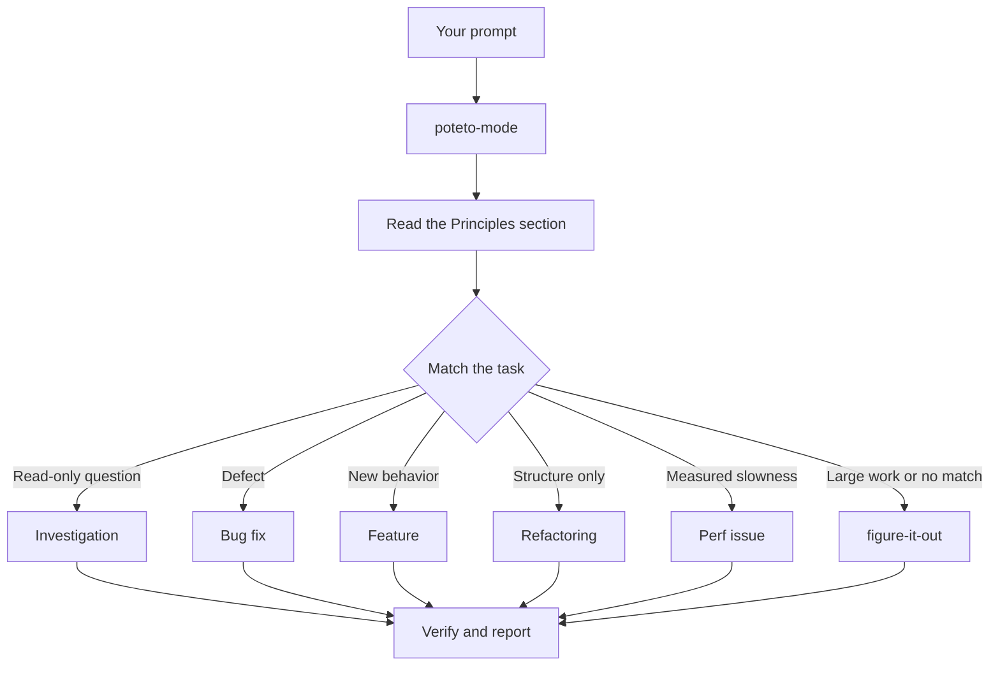

> [!NOTE]
> **来源**
>
> 这是中文译文，方便对照阅读。本站不发行中文版插件。
>
> 对照英文：[本站英文页](https://pstack.ganhai.cloud/en/skills-zh/official-guide/02-poteto-mode/)
>
> 英文原文出处：cursor/plugins 仓库 [`pstack/docs/guide/02-poteto-mode.md`](https://github.com/cursor/plugins/blob/d73344bee8cf22e53b9d5f4cf5749d38ba38c174/pstack/docs/guide/02-poteto-mode.md)（提交 `d73344b`）

# 把工作交给 `/poteto-mode`

`/poteto-mode` 是总入口。你给它一个目标，它从二十三个 playbook 里匹配出一个，把这个 playbook 的步骤抄进 todo 列表，再按步骤需要调用其他 skills。这一页讲好的提示词长什么样，也让你看到，真正需要写的其实很少。


## 看提示词会走到哪



图里画的是常见路线。此外还有一些 playbook，分别用来持续优化某个指标、诊断运行时症状和抓取到的 trace、做原型、让界面像素级对齐、编写和评估 skill、让 agent 自主跑完长任务、把单个 PR 或一组堆叠 PR 照看到可以合并、交付一组验证过的堆叠 PR、全自动跑完一队 PR、统筹整个项目规模的工作、接手之前的会话、安全地暂停、推进多阶段计划，以及清理 worktree（同一个仓库另外检出的一份独立工作目录）。全部 playbook 见 [playbook 目录](../skills/poteto-mode/SKILL.md)。

## 直接说目标

你不用写规格文档。说清哪里出了问题，或者你想要什么，再补上你已经知道、能帮 agent 省时间的信息：

```text
/poteto-mode users get two notifications after a retry. repro first, then fix and verify.
```

这是一条 Bug fix 提示词。「repro first」（先复现）是实打实的约束，不是客套话，playbook 会照办。看着 todo 列表填上 Bug fix 的各个步骤。跳过的步骤也看得见，会标着 `skip: <reason>`。

<a id="what-goes-in-a-prompt"></a>
## 提示词里写什么

一条有用的提示词最多带五样东西，每一样用一句话说完就够：

- **目标。** 说清哪里出了问题，或者你想要什么。
- **完结检查。** 必须能判定通过或失败。「Make it better」和「work on it for an hour」都不是检查。
- **你要看见的证据。** 要真实命令的输出、流程的录像、存下来的值，或者改动前后的数字。
- **你已经知道的。** 一个症状、一步复现、一行日志，或一条链接，都能给 agent 省一次搜索。
- **真正的约束。** 「repro first」「don't change any code yet」「zero behavior change」「let me review before proceeding」，每一条都会改变 agent 怎么做。

下面这一条五样都有：

```text
/poteto-mode the csv export drops its last row since yesterday's deploy. failing job id is 4812. repro first, then fix. done means the 60k-row fixture exports every row. show me the row counts before and after.
```

有两样值得先不写：

- **怎么做。** 说清要做到什么，留给 agent 自己找路。它找到的路，可能比你点的那条更好。下面那个坑里说的 skill 清单，也是同一回事。
- **你自己对原因的猜测，先别说。** 一上来就给出猜测，搜索会被你指到的地方收窄。先让 agent 用自己的话重述问题，再分享你的直觉。

报告很吵的时候，比如一长串讨论，或一个说不清的 bug，把重述当成第一步：

```text
/poteto-mode read this thread. restate the underlying issue in your own words, in plain english. don't change any code yet.
```

读错了，会先出现在重述里，这时还没有任何代码。在那里纠正，代价是一条消息，不是一次修错。

## 跟进写短

如果对话里已经有了上下文，提示词可以短到几乎没有。下面每一条都够用：

```text
/poteto-mode do it
```

```text
continue
```

```text
keep going until done
```

这么短也行，因为结构都在 playbook 里，Custom Mode 又会让 `/poteto-mode` 每一轮都留在上下文。[安装 pstack](./01-setup.md#run-your-first-task) 讲了怎么开一个。意图由你的话来说，严谨由 skill 来保证。

## 用「new task」切换任务

聊得久了，对话里会积下上一个任务的上下文。换话题的时候，直接说出来：

```text
/poteto-mode new task. figure out why the cache entry survives logout. don't change any code yet.
```

「new task」让 `/poteto-mode` 重新匹配 playbook，不再沿用上一个。「don't change any code yet」（先别改任何代码）把这次任务锁定在 Investigation。少了这两句，正做到 Feature 一半的 mode 往往会把你的问题当成 Feature 的下一步。

## 给并行工作各自一台机器

几个 agent 在同一台电脑上对着同一个仓库干活，就会抢工作区、端口和构建产物。隔离最干净的办法是 [cloud subagent](https://cursor.com/docs/subagents#cloud-subagents)。每一个都有自己的虚拟机和分支，可以装依赖、跑应用、录下结果的视频，又碰不到你这台机器。任务前面键入 `/in-cloud`，或者让父聊天把活交给 cloud subagent。

活必须留在本地时，一开始就要求一个 worktree：

```text
/poteto-mode new task. branch off <base> in a fresh worktree, then port the parser change there.
```

每个任务各用自己的分支和 worktree，agent 之间就不会踩到彼此的文件。worktree 要占磁盘和机器资源，一台笔记本一次只能跑少数几个。[Opening a PR playbook](../skills/poteto-mode/playbooks/opening-a-pr.md) 改代码时本来就在 worktree 里做。所以一般只有在你要指定从哪个分支切出、放在哪里时，才需要特意说这句。

worktree 会越积越多。磁盘紧张时，可以这样问：

```text
/poteto-mode what's eating my disk? prune the worktrees that are safe to prune.
```

[Worktree cleanup playbook](../skills/poteto-mode/playbooks/worktree-cleanup.md) 会按三点给每个 worktree 归类：是否已经合并、有没有未提交的改动、还有哪些聊天在用它。它只删这些证据表明可以删的。只要还有未提交的改动，它就停下来等你决定。

## 让它继续跑

你要走开时，说清楚怎样算做完，然后就可以走了：

```text
/poteto-mode im stepping away. keep going until the migration check reports zero old callers. log your decisions.
```

打算回头再审的工作，会交给 [`/figure-it-out`](../skills/figure-it-out/SKILL.md)。它负责设计这次运行分哪几个阶段，并用 [`/show-me-your-work`](../skills/show-me-your-work/SKILL.md) 记一份决策日志。完整的过夜交接约定，见 [睡觉时让工作继续跑](./07-overnight.md)。

**坑：** 别在提示词里把 skills 一个个列出来（「use /how, then /architect, then /arena...」）。playbook 已经排好了顺序。你手写的顺序往往会打乱步骤，或者漏掉 playbook 本来会保留的步骤。只有想推翻某个具体选择时，才点名某个 skill。

完整的分派规则，直接读 [`poteto-mode`](../skills/poteto-mode/SKILL.md) 本身。

下一篇：[理解代码](./03-understand.md)。
