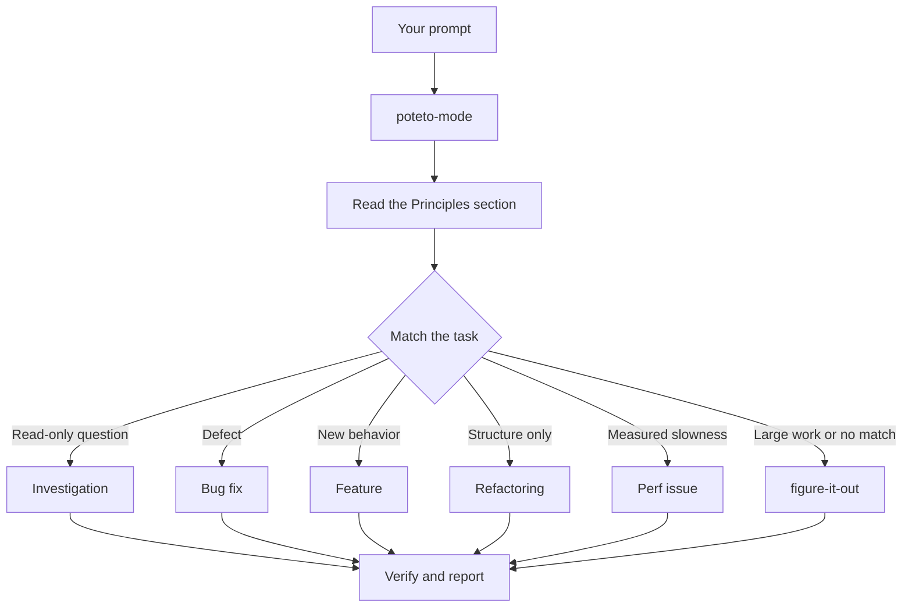

> [!NOTE]
> **来源**
>
> 这是中文译文，方便对照阅读。本站不发行中文版插件。英文原文 [`pstack/docs/guide/02-poteto-mode.md`](https://github.com/cursor/plugins/blob/12d587dfb20741cafc376c42c696c5f6e2a64487/pstack/docs/guide/02-poteto-mode.md)，取自 pstack 官方仓库 cursor/plugins 的提交 `12d587d`。
>
> [本站英文页](https://pstack.ganhai.cloud/en/skills-zh/official-guide/02-poteto-mode/)

# 把工作交给 `/poteto-mode`

`/poteto-mode` 是入口。你给出目标。它在二十三个 playbook 里选一个，把步骤抄进 todo，需要时再去调别的 skills。这一页讲两件事：好的提示词长什么样，以及你其实只要写很短。


## 看提示词会走到哪



这张图画出常见路线。另外还有这些 playbook：把某个指标 hillclimb、诊断运行时症状和已捕获的 trace、prototype、visual parity、编写和评估 skills、自主运行、把 PR 或栈照顾到可合并、交付已验证的栈、自动跑 PR 队列、编排项目规模的 program、session pickup、安全地暂停、多阶段计划，以及 worktree 清理。[playbook 目录](../skills/poteto-mode/SKILL.md) 里有全套。

## 说目标，别说仪式

你不写规格。你说哪里错了，或你想要什么，再加上任何你已经知道、能给 agent 省时间的事：

```text
/poteto-mode users get two notifications after a retry. repro first, then fix and verify.
```

这是一条 Bug fix 提示词。「repro first」是真约束，不是客气话。playbook 会照做。看 todo 列表，里面会填上 Bug fix 的步骤。跳过的步骤还留在列表里，并带 `skip: <reason>`。

对话里已经带着上下文时，提示词会缩到几乎没有。下面每一条都够：

```text
/poteto-mode do it
```

```text
continue
```

```text
keep going until done
```

这么短也够用。这个 mode 会一直开着，结构在 playbook 里。你的话带着意图。skill 带着严谨。

## 用「new task」切换任务

长聊天会积下上一个任务的上下文。换话题时，说出来：

```text
/poteto-mode new task. figure out why the cache entry survives logout. don't change any code yet.
```

「new task」告诉 `/poteto-mode` 重新匹配，而不是继续上一个 playbook。「don't change any code yet」把这一次钉在 Investigation 上。没有这两句，一个正处在 Feature 中途的 mode 往往会把你的问题当成下一步 feature 步骤。

## 给并行工作各自一个 worktree

几个 agent 对着同一个仓库跑，它们会抢同一份工作区。一开始就要求隔离：

```text
/poteto-mode new task. branch off <base> in a fresh worktree, then port the parser change there.
```

每个任务用自己的分支和 worktree，就没有 agent 会踩到另一个的文件。[Opening a PR playbook](../skills/poteto-mode/playbooks/opening-a-pr.md) 做代码改动时本来就从 worktree 开工。所以多数时候，只有某个具体的 base 或位置要紧时，你才说这句话。

worktree 会堆积。磁盘吃紧时就问：

```text
/poteto-mode what's eating my disk? prune the worktrees that are safe to prune.
```

[Worktree cleanup playbook](../skills/poteto-mode/playbooks/worktree-cleanup.md) 按合并状态、未提交的工作，以及哪些聊天还在碰它，给每个 worktree 分类。它只删除那份证据放行的部分。凡是还握着未提交工作的，停下来等你决定。

## 让它继续跑

你走开时，说清楚怎样算做完，然后走：

```text
/poteto-mode im stepping away. keep going until the migration check reports zero old callers. log your decisions.
```

你回头才审的工作，会走 [`/figure-it-out`](../skills/figure-it-out/SKILL.md)。它设计这次运行的各个阶段，并留一份 [`/show-me-your-work`](../skills/show-me-your-work/SKILL.md) 决策日志。[你睡觉时让工作继续跑](./07-overnight.md) 讲过夜之前要说清什么。

**坑：** 不要在提示词里把 skills 逐个列出来（「use /how, then /architect, then /arena...」）。playbook 已经排好顺序。手写的顺序通常会重排，或丢掉 playbook 本会留下的步骤。只有当你想覆盖某个具体选择时，才点名一个 skill。

路由的完整规则，读 [`poteto-mode`](../skills/poteto-mode/SKILL.md) 本身。

下一篇：[理解代码](./03-understand.md)。
