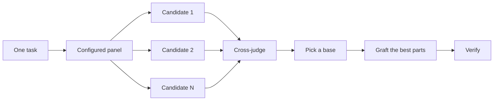

> [!NOTE]
> **来源**
>
> 这是中文译文，方便对照阅读。本站不发行中文版插件。
>
> 对照英文：[本站英文页](https://pstack.ganhai.cloud/en/skills-zh/official-guide/04-design/)
>
> 英文原文出处：cursor/plugins 仓库 [`pstack/docs/guide/04-design.md`](https://github.com/cursor/plugins/blob/12d587dfb20741cafc376c42c696c5f6e2a64487/pstack/docs/guide/04-design.md)（提交 `12d587d`）

# 写代码之前先设计

难的设计如果只试一次，模型最先想到的形状就会定死。`/architect` 在写代码之前先定类型和边界。`/arena` 拿同一份简报试好几次，再把最好的部分并到一起。`/interrogate` 让别的模型来找这个结果的漏洞。如果这件工作是覆盖，而不是把设计收成一份，`/swarm` 会把切片或 race 铺开，再把结果汇总回来。


## 用 `/architect` 定下形状

```text
/architect design the import pipeline before writing any code. i care most about how callers use it.
```

[`/architect`](../skills/architect/SKILL.md) 先扎根。对设计会碰到的代码跑 `/how`。当它移动所有权或分层时跑 `/why`。然后它跑 `/arena`，产出互相竞争的设计草图。每份都先写调用方的用法，接着是类型、签名和模块图。

默认它从综合后的设计直接进入实现。如果你想先看见设计，就这么说：

```text
/architect with checkpoint. stop and show me before implementing.
```

## 用 `/arena` 扇出多次尝试

```text
/arena take my prompt to the arena verbatim. i want to compare their proposals with yours.
```

[`/arena`](../skills/arena/SKILL.md) 是底下的通用工具。N 个子代理并行尝试同一份设计或代码简报，每个都写到自己的 worktree 或目录。一个只读裁判，在你的配置允许时来自不同的模型族，对照一份评分标准给每个候选打分。协调者把每个候选从头读到尾，选出一个基座，把失败者里最好的想法嫁接进去，并验证结果。



面板来自你的 [`/setup-pstack`](../skills/setup-pstack/SKILL.md) 配置，而且你可以按任务调整它。决策要紧时，多要几个候选。不要紧时，少要几个：

```text
/arena this, 5 candidates. the cache key format is expensive to change later.
```

## 用 `/swarm` 覆盖切片和 race

```text
/swarm check every package under packages/ against its check.sh. one worker per package. one report.
```

[`/swarm`](../skills/swarm/SKILL.md) 把 N 个 worker 扇到互相独立的切片、覆盖矩阵、gauntlet lane、探索分区，或已声明的 race arm 上。每个 worker 拿到自己的范围和检查，然后报告 `PASS`、`ISSUES` 或 `BLOCKED`。父级等待这些 worker，交回一份紧凑报告，带上任何缺口或掉队。

当并行能换来覆盖，或能让互相独立的检查去赛跑时，用它。`/arena` 给每个 worker 同一份设计或代码简报，然后选出基座，并嫁接最好的部分。`/swarm` 覆盖切片，或按事先声明的选择规则跑一场 race。它不用选基座和嫁接那套仪式。

## 用 `/interrogate` 拆掉它

```text
/interrogate the whole branch, but skeptically. no nitpicks unless it's an actual bug or regression.
```

[`/interrogate`](../skills/interrogate/SKILL.md) 把同一份 diff、意图和评分标准，发给不同模型族上的几个审查者。模型多样性才是目的。不同模型有不同盲区。两个模型各自独立提出的 finding，是高置信度的信号。负责人把所有内容分成 `Act on`、`Consider`、`Noted` 和 `Dismissed`。每条驳回都附理由。它不会自动应用任何一条。

驳回也要读。负责人是务实的资深工程师，不是神谕。你可以推翻它。

## 这个任务要做多少设计

你可能会问，是不是每次改动都要上这些。不用。大多数改动一个都不用。大致这样分：

- 改动小、已经做完、你又没把握，只跑 `/interrogate`。
- 改动跨过函数边界，或动了所有权，就用 `/architect`。它会带上 `/arena`。
- 一个可以各自试的独立决定，比如命名、格式或算法，直接用 `/arena`。
- 覆盖矩阵、一组并行检查，或 arm 已经声明好的 race，用 `/swarm`。
- 设计有争议，而且推翻成本高，先用 `/architect`，交付前再用 `/interrogate`。

`/poteto-mode` 已经按这个阶梯在走。跨边界的工作会自己触发 `/architect`。你亲手去调，通常是因为你想比默认看得更严，或更松。

下一篇：[构建并清理这次改动](./05-build-and-clean.md)。
