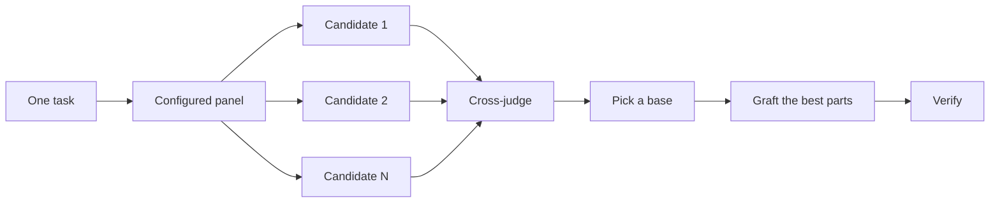

> [!NOTE]
> **来源**
>
> 这是中文译文，方便对照阅读。本站不发行中文版插件。
>
> 对照英文：[本站英文页](https://pstack.ganhai.cloud/en/skills-zh/official-guide/04-design/)
>
> 英文原文出处：cursor/plugins 仓库 [`pstack/docs/guide/04-design.md`](https://github.com/cursor/plugins/blob/d73344bee8cf22e53b9d5f4cf5749d38ba38c174/pstack/docs/guide/04-design.md)（提交 `d73344b`）

# 写代码之前先设计

难的设计只试一次，模型最先想到的那个形状就定死了。`/architect` 在动手实现之前，先定下类型和边界。`/arena` 拿同一份任务说明试好几次，再把各自最好的部分合到一起。`/interrogate` 让别的模型来挑这个结果的毛病。如果这件事要的是覆盖面，不是把几份设计合成一份，就用 `/swarm`。它把工作切成几块分头做，或者发起 race（几个 worker 做同一件事，按规则选出结果），最后汇总。

最常见的两种设计错误，是接住 agent 的第一版设计，以及打磨一份还没有代码试过的计划。这一页把两处都改掉。你用代码来做计划：原型回答还没定的问题，README 或 tutorial 定下目标，写出来的计划放在最后。


## 用 `/architect` 定下形状

```text
/architect design the import pipeline before writing any code. i care most about how callers use it.
```

[`/architect`](../skills/architect/SKILL.md) 会先摸清现状。它对设计要动到的代码跑 `/how`。如果设计会改变职责归属或分层，还会跑 `/why`。然后它跑 `/arena`，产出几份互相竞争的设计草图。每份草图先写调用方怎么用，再写类型、函数签名和模块图。

默认情况下，它合成出设计后会直接开始实现。如果你想先看设计，就直说：

```text
/architect with checkpoint. stop and show me before implementing.
```

设计一旦开始写代码，就不是圣旨。实现如果在互不相关的地方反复出现同一种 workaround，或者类型只有靠 `any` 或强制转换才能编译，`/architect` 就把这当作设计错了的证据。它会扔掉草图重来，而不是在旁边打补丁。

## 用 `/arena` 并行试几版

```text
/arena take my prompt to the arena verbatim. i want to compare their proposals with yours.
```

[`/arena`](../skills/arena/SKILL.md) 是更底层的通用工具。N 个子代理拿着同一份设计或代码任务说明并行去做，各自写进自己的 worktree（同一个仓库另外检出的一份独立工作目录）或目录。一个只读的裁判按评分标准给每个候选打分。只要你的配置允许，这个裁判会来自另一个模型族。协调者把每个候选从头读到尾，选一个作为基底，把落选候选里最好的想法嫁接进来，再验证结果。



这组模型来自你的 [`/setup-pstack`](../skills/setup-pstack/SKILL.md) 配置，每个任务还可以单独调。决定要紧，就多要几个候选。不要紧，就少要几个：

```text
/arena this, 5 candidates. the cache key format is expensive to change later.
```

## 用 `/swarm` 分块覆盖和竞速

```text
/swarm check every package under packages/ against its check.sh. one worker per package. one report.
```

[`/swarm`](../skills/swarm/SKILL.md) 把 N 个 worker 分派出去，各管一块。这些块可以是互不相干的切片、覆盖矩阵、gauntlet lane（压力测试里各自独立的一路检查）、探索时划分出的区域，或者事先声明好的 race arm（race 里的每一路）。每个 worker 有自己的范围和检查，做完报告 `PASS`、`ISSUES` 或 `BLOCKED`。父 agent 等所有 worker 回来，交回一份精简的报告，标出哪里有缺口、哪个 worker 掉了队。

当并行能换来覆盖面，或者能让几项独立的检查同时竞速时，就用它。`/arena` 给每个 worker 同一份设计或代码任务说明，再选出基底，把最好的部分嫁接上去。`/swarm` 是分块覆盖，或者按事先声明的选择规则跑一场 race。它不走选基底、做嫁接那一套流程。

## 用 `/interrogate` 挑出破绽

```text
/interrogate the whole branch, but skeptically. no nitpicks unless it's an actual bug or regression.
```

[`/interrogate`](../skills/interrogate/SKILL.md) 把同一份 diff、意图说明和评分标准，发给来自不同模型族的评审者。要的就是模型各不相同。不同模型的盲区不同，所以两个模型各自独立提出的同一个 finding（评审发现的问题），是很可靠的信号。主审把所有意见分成 `Act on`、`Consider`、`Noted` 和 `Dismissed` 四类，每驳回一条都写明理由，而且不会自动改动任何东西。

驳回的那些也要读。主审的定位是务实的资深工程师，不是神谕。你可以推翻它。

## 用原型来定，不要靠争论

绝不要接住第一版设计。要几份，再从你看得见的证据里挑：

```text
/poteto-mode prototype a few options for the new dropdown menu. take screenshots or videos for me to compare.
```

[Prototype playbook](../skills/poteto-mode/playbooks/prototype.md) 在临时目录里搭用完就扔的草样，把各个变体放在同一个切换器后面，逐个操作，再截图或记耗时。行为和算法也能这样用，不只是界面。原型就是用代码做计划。agent 靠跑起来的东西回答自己还没定的问题，不用来问你，也给了你想不到的选项留下空间。

同一思路放大到真正的设计。把 `/architect` 和原型配在一起，并留下一道审查关：

```text
/poteto-mode we need rate limiting for external webhooks. /architect it first, and answer open questions with prototypes. let me review before proceeding.
```

别把评审者花在一份抽象计划上。`/interrogate` 该对着一份 diff。对着还没有代码的计划做对抗审查，评审者会编出永远不会发生的理论风险和边角情况。先用原型把问题定下来，再审已经做出来的东西。

## 共享代码先写 README

给别的代码用的包或 API，从用户会读的那份文档写起：

```text
/poteto-mode write a tutorial for how i would use the new config package first. then /teach me why it beats the current one.
```

先写 tutorial，会逼你站在调用方那边看。你先对一个假想用户讲清 API，再倒推实现。这份文档也会变成 agent 用来核对自己工作的具体目标。文档本身要紧时，点名 [`/technical-writing`](../skills/technical-writing/SKILL.md)，让 tutorial 继续是 tutorial，不要同时滑进 reference 和 explanation。

## 设计定了再写计划

pstack 故意没有规划 skill。真要一份写出来的计划，等设计定了再要：

```text
/poteto-mode turn this design into a plan. small verifiable PRs, each with its own verification steps.
```

[Multi-phase plan playbook](../skills/poteto-mode/playbooks/multi-phase-plan.md) 先用原型把还没定的问题定下来，再按 PR 一节一节写，每一节都以证明这次改动能用收尾。测试套件通过，单独不算这份证明。计划就是交付物。这个 playbook 不实现它，并会点名下一步该跑哪个执行 playbook。

做迁移时，把门槛写进提示词：

```text
/poteto-mode plan the migration of our ui library to the new styling system. small verifiable PRs, each with visual regression checks. the result must match the original exactly, bugs included.
```

「bugs included」拦住迁移路上悄悄修掉的东西。旧输出和新输出对不上，就没法比。跨好多天的项目，可以把计划先提交进仓库一段时间，好让别的 agent 看见进行中的工作。活落地了再删。

## 这个任务要做多少设计

你可能会想，是不是每次改动都要走这些。不用。大多数改动一样都用不上。大致可以这样分级：

- 改动小、已经做完，但你心里没底，只用 `/interrogate` 就够了。
- 改动跨过函数边界，或者改变了职责归属，就值得用 `/architect`，它会顺带用上 `/arena`。
- 单独一个决定，比如命名、格式或某个算法，如果几份各自独立的尝试会有帮助，就直接用 `/arena`。
- 覆盖矩阵、一组并行检查，或者已经声明好各个 arm 的 race，用 `/swarm`。
- 一个还能靠跑起来的东西回答的问题，比如布局、耗时或做法，就做原型，不要争论。
- 设计有争议，而且推翻重来代价很高，就先用 `/architect`，交付之前再跑一遍 `/interrogate`。
- 跨好几个 PR 的活，等设计定了再写计划。

`/poteto-mode` 本来就按这套分级在做。跨边界的工作会自动触发 `/architect`。所以你亲自调用这些 skill，主要是想比默认查得更严或更松的时候。

下一篇：[构建并清理这次改动](./05-build-and-clean.md)。
