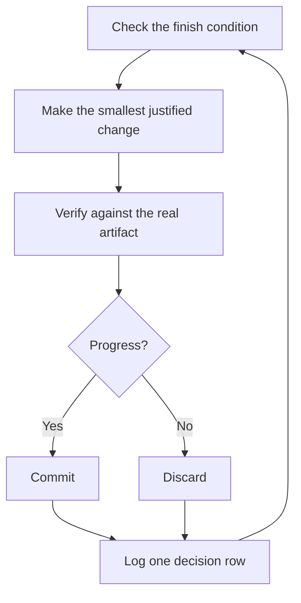

> [!NOTE]
> **来源**
>
> 这是中文译文，方便对照阅读。本站不发行中文版插件。英文原文 [`pstack/docs/guide/07-overnight.md`](https://github.com/cursor/plugins/blob/12d587dfb20741cafc376c42c696c5f6e2a64487/pstack/docs/guide/07-overnight.md)，取自 pstack 官方仓库 cursor/plugins 的提交 `12d587d`。
>
> [本站英文页](https://pstack.ganhai.cloud/en/skills-zh/official-guide/07-overnight/)

# 睡觉时让工作继续跑

这是前面一切的回报。你能信任一个代理自己做验证，就可以把它单独留下，去做一件难任务。安全不靠希望。靠的是可检查的完结条件、隔离的 worktree，以及一份你早上审计的决策日志。


## 过夜前先说清

一次好的交接要有目标、完结条件、权限和一条退路。不必写很长：

```text
/poteto-mode im going to bed. migrate every caller to the new parser in a fresh worktree off <base>.
done means zero old callers, all parser fixtures pass, old api deleted.
keep a decision log. don't ask me before committing.
/loop until done. if you're truly stuck after a few hours, stop and write up why.
```

逐行看每一行换来什么：

- 「im going to bed」是会话级覆盖。代理不再提问，继续往下做。
- 「done means...」把目标变成每一轮都能跑的检查。
- 「fresh worktree off `<base>`」让这次运行不和你开着的其他东西相撞。
- 「don't ask me before committing」预先回答了代理本来会卡住等待的那项权限。
- `/loop` 是 Cursor 内置的唤醒机制，不是 pstack 的 skill。[Autonomous run playbook](../skills/poteto-mode/playbooks/autonomous-run.md) 用它在事件或心跳上重新检查完结条件。
- 退路让它在真正走不通时停下，并写明原因。这好过花八小时创造性地重新解释目标。

因为你会在离开之后审这份工作，`/poteto-mode` 会把它路由到 [`/figure-it-out`](../skills/figure-it-out/SKILL.md)。这个 skill 在写任何代码之前先设计这次运行的阶段，并接上决策日志。

## 夜里的循环在做什么



每一轮：一处改动，一次检查，一行日志。没有帮助的改动会被丢掉，不会留着一起往前走。平台期意味着转向，不是停下。完结条件也绝不会悄悄放宽，用来宣布胜利。

## 早上的审计

[`/show-me-your-work`](../skills/show-me-your-work/SKILL.md) 让这次运行可以复审。每一行记录时间、阶段、决定、理由、一个证据指针和结果。格式是 TSV，放在 `decisions.tsv`（多个运行共用一个目录时，放在 `.audit/<task-slug>.tsv`）。默认留在本地。工作大到审查者需要 trail 才能信任结果时，再把它提交。

你回来后，用复审的形式要这次运行：

```text
/show-me-your-work catch me up on what you did last night
```

skill 交回摘要之前，会在另一个模型族上启动一个审查者，去读 trail 和对话记录。回复以 Attention 一节结尾，列出值得你细看的地方。先读这一节，再读它指向的日志行。你在审计决定，不是把整夜重读一遍。

## 夜里跑一整条队列

上面说的是一件事，赶到一个完结条件。有的晚上要跑更多：一队列独立改动，或一整项计划。三个 playbook 把同一份信任放大。

[Autopilot-full](../skills/poteto-mode/playbooks/autopilot-full.md) 把一队列独立 PR 跑到已合并。每个 PR 有一个负责的代理，从构建带到合并。没有负责者能凭自己的 verdict 合并。一群新的验证者在负责者代码就绪的 head 上开一轮。之后每次改变补丁的 push，再开一轮。只有对即将合并的那份补丁给出干净 verdict，才授权合并：

```text
/poteto-mode full autopilot on this queue. each item is independent. i want them merged by morning.
```

[Autopilot-stack](../skills/poteto-mode/playbooks/autopilot-stack.md) 跑同一个负责者循环，但什么都不发布。你醒来会看到一条线性的基分支栈，每一环都有验证者的 verdict。你自己复审并落地。改动彼此耦合时选它。你想在任何东西合并之前亲自看过，也选它，而不是 Autopilot-full：

```text
/poteto-mode autopilot these five changes but stack them, don't ship. i'll land the stack in the morning.
```

[Orchestrate](../skills/poteto-mode/playbooks/orchestrate.md) 用于比任何一个代理都活得久的计划：多日，许多叠放的 PR，一个常驻协调对话下面的一队子代理。协调者撰写简报，收集子代理做完的东西，让最低的未合并 PR 保持绿色，自己从不写代码。这是故意做重的机器。如果一个代理一次会话就能做完，这个 playbook 自己会把你送回上面那一节，过夜前先说清：

```text
/poteto-mode orchestrate the store migration. own it until every package is converted and merged. i'll check in twice a day.
```

**坑：** 时长不是完结条件。「work on this for 4 hours」没给代理任何可检查的东西。你会醒来看到四小时都在动，却没有结果。给 `/loop` 一个能通过或失败的条件。

下一篇：[用原则名来转向](./08-principles.md)。
