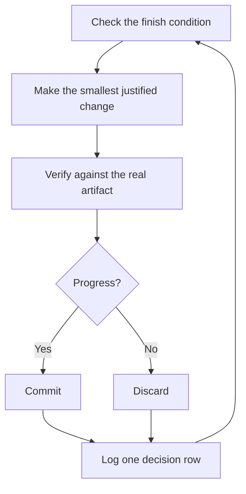

> [!NOTE]
> **来源**
>
> 这是中文译文，方便对照阅读。本站不发行中文版插件。
>
> 对照英文：[本站英文页](https://pstack.ganhai.cloud/en/skills-zh/official-guide/07-overnight/)
>
> 英文原文出处：cursor/plugins 仓库 [`pstack/docs/guide/07-overnight.md`](https://github.com/cursor/plugins/blob/d73344bee8cf22e53b9d5f4cf5749d38ba38c174/pstack/docs/guide/07-overnight.md)（提交 `d73344b`）

# 睡觉时让工作继续跑

前面学的所有东西，在这一页兑现。如果你信得过 agent 会自己验证自己的工作，就可以把一件难事交给它，人走开。放手不管还能安全，靠的不是盼着别出事。靠的是可检查的完结条件、隔离的 worktree（同一个仓库的另一份独立工作目录）或 cloud agent，以及一份你早上来审的决策日志。


## 先赢得信任再开循环

你信不过的循环，只会更快地造出没核对过的活，而且每多一轮，乱就多一层。让它自己跑之前，先确认它配得上：

- 你亲手做过一次，或看着 agent 做过一次，所以知道做成什么样才算好。
- agent 手里有你自己会用的那些工具和信号：验证 skill、profiler、日志。
- 每一阶段都证明自己的工作，达不到门槛就能把整条线停住。
- 你读过几份对话记录，把反复出现的失败做成了工具、skill 或检查。

四条都站住了，再让循环自己跑。在那之前，你看着它跑。

## 过夜前先说清

好的交接要有目标、完结条件、权限，还要留一条退路。不用写很长：

```text
/poteto-mode im going to bed. migrate every caller to the new parser in a fresh worktree off <base>.
done means zero old callers, all parser fixtures pass, old api deleted.
keep a decision log. don't ask me before committing.
/loop until done. if you're truly stuck after a few hours, stop and write up why.
```

逐行看，每一行给你带来什么：

- 「im going to bed」会覆盖这次会话的默认行为。agent 不再提问，一直做下去。
- 「done means...」把目标变成每一轮都能跑的检查。
- 「fresh worktree off `<base>`」让这次运行不会撞上你开着的其他工作。
- 「don't ask me before committing」提前给了权限，不然 agent 会停下来等你点头。
- `/loop` 是 Cursor 自带的唤醒机制，不是 pstack 的 skill。[Autonomous run playbook](../skills/poteto-mode/playbooks/autonomous-run.md) 用它在有事件发生或定时心跳时，重新检查完结条件。
- 有了退路，它碰到真正的死胡同就能停下，写明原因。这总比花八个小时变着花样重新解读目标强。

因为这份工作要等你回来再审，`/poteto-mode` 会把它交给 [`/figure-it-out`](../skills/figure-it-out/SKILL.md)。这个 skill 在写任何代码之前，先设计好这次运行分几个阶段，并接上决策日志。

想主动停一次运行，告诉 agent 暂停，或者说你马上要离线或重启 Cursor。[Pause safely playbook](../skills/poteto-mode/playbooks/pause-safely.md) 会把当前这一步做完或退回去，提交一份进行中的检查点，并写一份接着做的说明。新开的聊天通过 Session pickup playbook，从那份说明接着做。说「keep going」绝不会触发暂停。

## 夜里的循环在做什么



每一轮都是一处改动、一次检查、一行日志。没帮上忙的改动直接丢掉，不让它搭便车。进展停住了，就换个思路，不是收工。完结条件也绝不会为了宣布成功而悄悄放宽。

## 早上的审计

有了 [`/show-me-your-work`](../skills/show-me-your-work/SKILL.md)，这次运行才审得了。每一行记下时间、阶段、决定、理由、证据在哪，以及结果，存成 TSV 放在 `decisions.tsv`（几次运行共用一个目录时，放在 `.audit/<task-slug>.tsv`）。它默认只留在本地。如果工作大到审查者得看这份 trail（一路记下的决策记录）才敢相信结果，就把它提交进仓库。

你回来以后，让它把这次运行整理成方便审查的样子：

```text
/show-me-your-work catch me up on what you did last night
```

交回总结之前，这个 skill 会用另一个系列的模型启动一个审查者，让它读 trail 和对话记录。回复最后有一节 Attention，列出值得你仔细看的地方。先读这一节，再看它指到的那几行日志。你要审的是决定，不是把整夜的过程重读一遍。

## 夜里跑一整条队列

上面那份交接，管的是一个任务、一个完结条件。有些晚上要做的更多，可能是一串互不相干的改动，也可能是一整个大项目。有三个 playbook 能把同样的信任放大到这种规模。

[Autopilot-full](../skills/poteto-mode/playbooks/autopilot-full.md) 把一串互不相干的 PR 一直跑到合并。每个 PR 配一个负责人 agent，从构建一路管到合并，但负责人不能凭自己的 verdict（验证后给出的判定）合并。负责人报告代码就绪时，一组新开的验证者会以 swarm（一群并行工作的子代理）的形式，在那一版上跑一轮验证。之后每次推送只要改动了补丁，就再跑一轮。只有最终合并的那份补丁拿到干净的 verdict，才能合并：

```text
/poteto-mode full autopilot on this queue. each item is independent. i want them merged by morning.
```

[Autopilot-stack](../skills/poteto-mode/playbooks/autopilot-stack.md) 跑同样的负责人循环，但一个都不合并。你醒来会看到从基础分支往上、一个接一个叠起来的一串 PR，每一环都带着验证者的 verdict，由你自己审完再合并。如果改动之间互相牵连，或者你想在任何东西合并之前亲眼看过，就用它代替 Autopilot-full：

```text
/poteto-mode autopilot these five changes but stack them, don't ship. i'll land the stack in the morning.
```

[Orchestrate](../skills/poteto-mode/playbooks/orchestrate.md) 用于任何一个 agent 都撑不到头的大项目：持续好几天，有很多叠在一起的 PR，还有成群的子代理，都归一个常驻的协调对话管。协调者写任务说明，收集子代理做完的东西，让最底下那个还没合并的 PR 保持全绿，自己从不写代码。这套机制是故意做得很重的。如果一个 agent 在一次会话里就能做完，这个 playbook 自己会把你指回上面「过夜前先说清」的做法：

```text
/poteto-mode orchestrate the store migration. own it until every package is converted and merged. i'll check in twice a day.
```

<a id="run-many-projects-in-parallel"></a>
## 并行跑多个 Project

一个 [Cursor Project](https://cursor.com/blog/projects) 给协调者 agent 一条持久的对话。协调者不写代码。它指挥子代理。子代理默认在云上跑，笔记本盖上了，活还在继续。这就是 Orchestrate playbook 要的形态。给协调者的提示词以 `/poteto-mode` 开头，它开出的子代理就会跟着 playbook 走。

几个习惯有帮助：

- 每一摊活单独一个 Project，比如一个功能、一次迁移、一轮性能推进，或一次还技术债。好几摊可以并排跑。
- 把相关聊天拖进这个 Project，做完的也算。它们会成为里面每个 agent 的上下文。
- 每个 PR 合并前先来一轮验证 swarm，让 Autopilot-stack 或 Autopilot-full 接着跑队列。
- 向协调者要一份有数据撑着的计划，并让它先用原型回答还没定的问题，再来问你。

一条提示词就能带起整个 Project，从调研做到执行：

```text
/poteto-mode refactor this repo so its architecture is more agent friendly. use /correct and /architect on past commits and review comments to find the mistakes agents make most here. use /recall for context from past chats. answer open questions with prototypes instead of asking me. come back with a plan backed by real data. once i approve it, run it with autopilot-stack or autopilot-full, and ask me which.
```

## 让循环自己启动

上面每一种循环，都还在等你去开。定时或按事件触发的自动化，把这一步去掉。软件维护正好拆成适合这样跑的几段：分拣一份报告，复现它，修好它，再验证修复。两条规则让这样一条线信得过：

- 每一阶段都能把整条线停住。分拣可以判定这份报告是预期行为，复现可以复现不出来，修复者可以判定这次改动风险太大。这些结果都有用，因为它们拦住坏活流到下一阶段。到了下一阶段，撤回的代价更高。
- 每一阶段都交出证据。复现附上坏掉状态的截图和视频，修复附上改动前后的证明。人可以先确认 agent 修对了东西，再去读一行代码。

pstack 把这套做成一份休眠的 [automation pack](https://github.com/cursor/plugins/blob/d73344bee8cf22e53b9d5f4cf5749d38ba38c174/pstack/automations/benny/README.md)，用来接 Slack 上的问题报告。一份自动化分拣每条报告。另一份复现已确认的 bug，也可能准备一份很小的草稿修复。让 agent 去看它的 [`FOR_AGENTS.md`](https://github.com/cursor/plugins/blob/d73344bee8cf22e53b9d5f4cf5749d38ba38c174/pstack/automations/benny/FOR_AGENTS.md)，并点名目标仓库，就能搭起来。

**坑：** 时长不是完结条件。「work on this for 4 hours」没给 agent 任何能检查的东西，你醒来只会看到它忙活了四个小时，却没有结果。给 `/loop` 一个能判定通过或失败的条件。

下一篇：[用原则名来转向](./08-principles.md)。
