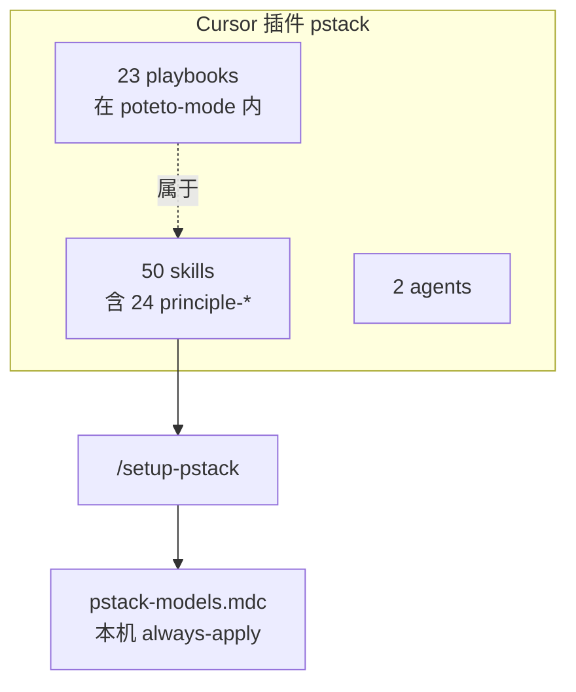
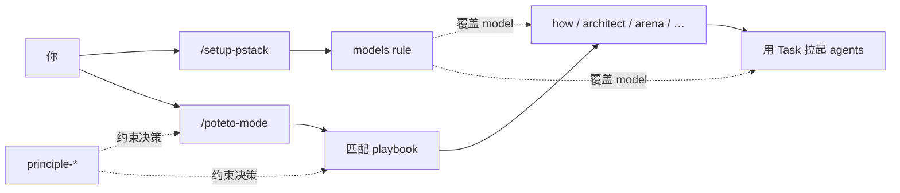
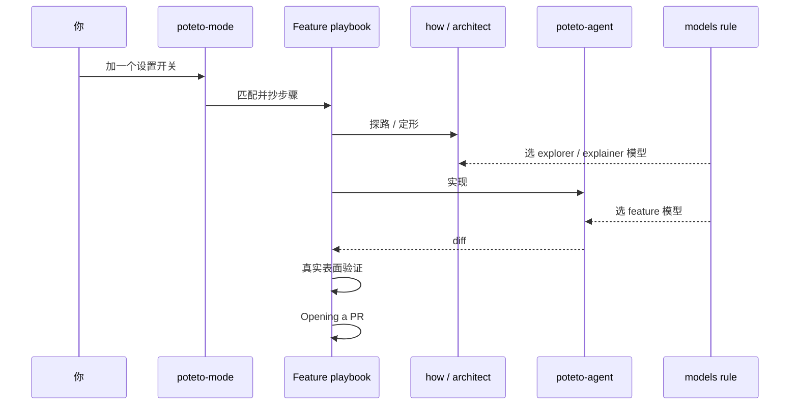

读完应能口述：有哪些零件、各干什么、一次日常改动里谁调用谁、什么让交付可验证。

本页是 explanation。查完整表去 [Skills 译文](../skills/INDEX.md)。

## 构成清单

官方插件装入 Cursor 的是 **skills** 与 **agents**。模型表不是插件静态文件，由 `/setup-pstack` 写到本机。

| 零件 | 数量（当前对照副本） | 一句话 |
|---|---|---|
| Skill | **50** | 可调用的工作流，以及一条条原则 |
| 其中 `principle-*` | **24** | 决策规则。一般不当 slash 入口 |
| Playbook | **23** | 挂在 `poteto-mode` 下的任务规程 |
| Agent | **2** | `poteto-agent`、`Comment Sicko` |
| Models rule | **1** | `~/.cursor/rules/pstack-models.mdc` |

没有名为「原子」的一等组件。「可验证单元」是原则 [sequence-verifiable-units](../skills/principle-sequence-verifiable-units/SKILL.md)，不是目录名。

## 各层干什么

用五层看，不要当成五个平级菜单。

| 层 | 回答的问题 | 干什么 | 不干什么 |
|---|---|---|---|
| **Mode**（`/poteto-mode`） | 现在按哪套规程干活 | 匹配 playbook、抄步骤进 todo、按需拉其他 skill、sticky 跨回合 | 不替代你写模型表 |
| **Playbook** | 这类任务逐步怎么做 | 做功能（Feature）、修 bug（Bug fix）、调查（Investigation）等操作规程 | 不是独立 slash skill |
| **Skill** | 某一步用什么能力 | `how`、`arena`、`unslop`，以及一条条原则 | 多数不必手点。mode 会路由 |
| **Agent** | 子任务用哪个人格跑 | Task 的 `subagent_type`。写代码常用 `poteto-agent` | 不是 Cursor Rules（`.mdc`） |
| **Rule**（models） | 谁演哪个角色、预算多深 | 覆盖 spawn 时的模型与 panel 人数 | 不教怎么写代码 |

查表用 [Skills 译文](../skills/INDEX.md)。

一条条原则只在**本会话已读过**时才能在回复里点名。未读不可假装用过。

## 谁使用谁

依赖方向是单向的。人先跑那两个入口命令。Mode 选 Playbook。Playbook 步骤拉 Skill。写代码的 Skill 或步骤会拉起 Agent。Models rule 覆盖「用哪款模型」。原则被 Mode 与 Playbook **引用**，不反过来拥有流程。

记忆口诀：

1. **Skill = 剧本与分工**（做什么、按什么规程）。
2. **Rule = 演员表**（谁演 explorer、panel 几个人）。
3. **Agent = 上台的角色契约**（先读 poteto-mode 的 wrapper 等）。

换掉 `poteto-agent` 用 `generalPurpose`，会跳过「先读完整 poteto-mode」那次，行为会漂。

## 做功能（Feature）走读：一次改动怎么走下来

假想你说：给设置页加一个可观察的开关。控制流大致如下。

1. **先跑入口命令。** 新机器先 `/setup-pstack`。日常任务进 `/poteto-mode`。
2. **匹配。** Mode 认成 **做功能（Feature）** playbook。把步骤原文抄进 todo。跳过的步骤留 `skip: 理由`。
3. **探路。** 步骤要求时跑 `/how`，弄清该改哪一层。跨边界设计时跑 `/architect`。
4. **实现。** 先命名数据形状，再写逻辑。多种合法形状时走 `/arena`，不靠一句「随便选」。写代码这一步通常交给 `poteto-agent`。难度与模型读 models rule。
5. **证明。** 对着真实界面或真实产物验证。「能编译」不算完成。这是 prove-it-works。
6. **收口。** 需要时 `/interrogate`、`/no-comments`。几乎每个写代码的 playbook 末尾都走开 PR（Opening a PR）。
7. **之后。** 把 PR 推到随时可以合并，是盯 PR（Babysit）。真要合进去，是上线（Shipping）。二者不是同一本 playbook。

日常四本是做功能（Feature）、修 bug（Bug fix）、重构（Refactoring）、做原型（Prototype）。只读问题走调查（Investigation）。过夜与程序级（figure-it-out、orchestrate、autopilot）另有阶梯，主课稍后练。

## 接下来

- [中文开发者能直接用吗](./for-chinese-devs.md)
- [Claude Code / Codex 能用吗](./beyond-cursor.md)
- [查 Skills 译文](../skills/INDEX.md)
