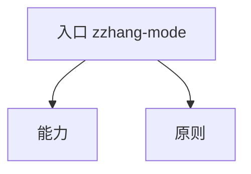

import { Card, CardGrid } from '@site-components/starlight-cards.ts';

Grok Bot 运营这个站时，照着下面这些 skills 做。站长想用同一套做法，再做一个 Matt Pocock skills 的中文站，才把它们写下来。规矩大多来自真踩过的坑。

## 入口

### zzhang-mode

`zzhang-mode` 先读这次要做的事，再选下面某一本 playbook，并调用对应的能力 skill。对不上任何一本时，先把步骤写出来给人看。

| playbook | 干什么 |
| --- | --- |
| `daily-sync` | 每天看原项目和作者文章有没有新东西，只译改过的部分 |
| `upstream-release` | 原项目发了新版本，译文和解读放在同一次改动里 |
| `weekly-voices` | 每周收录讨论多、能核对原文的社区评价 |
| `retranslate-batch` | 原文没变、要改中文时，分批重译，并要站长接受 |
| `site-change` | 改页面、导航或样式，以读者看到的页面为准 |
| `shipping` | 每次改动的收尾，验证之后要站长同意才上线 |
| `seo-push` | 让搜索引擎和 AI 助手找得到这个站 |
| `reader-report` | 读者指出问题后，先在页面上复现，再决定怎么改 |
| `open-site` | 从一个 skills 库做到中文站第一次上线 |

## 能力

<CardGrid>

<Card title="translate-page">

**管什么。** 把一页英文译成给中文读者看的中文。代码、命令、路径和 skill 名保持英文。

**什么时候用。** 要译 skill、指南、说明或作者文章的时候。

</Card>

<Card title="release-explainer">

**管什么。** 用大白话写这一版改了什么、为什么重要、以后怎么做。

**什么时候用。** 原项目发了新版本，译文一起上线的时候。

</Card>

<Card title="site-verify">

**管什么。** 在真实页面上核对改动。该截图时，按手机宽和桌面宽来拍。

**什么时候用。** 读者能看见的改动要验收的时候。

</Card>

<Card title="traffic-report">

**管什么。** 汇总前一天有多少人来过、看了哪些页、从哪来。

**什么时候用。** 每天早上看访问，并据此建议下一步先译什么、写什么。

</Card>

<Card title="translation-model-bakeoff">

**管什么。** 几个模型译同一段原文，盲评打分，定下以后用的那一个。

**什么时候用。** 要选定翻译模型，或想换掉它的时候。过程记在 [六个模型翻同一篇文章：本站怎么选翻译模型](/updates/translation-model-bakeoff/)。

</Card>

<Card title="handoff-brief">

**管什么。** 把一件事写成带步骤和验收标准的说明，交给另一个 bot 或 agent。

**什么时候用。** 接手的人看不到这次聊天，只靠这份说明也要能做完的时候。

</Card>

</CardGrid>

## 原则

<CardGrid>

<Card title="principle-cite-or-mark-inference">

**规矩。** 写到作者或别人，每句要么有出处，要么标明是推断。

**来自。** 替作者补一个动机，读者会当成作者本人说的。冒充作者发言，也收不回来。

</Card>

<Card title="principle-reader-facing-pages">

**规矩。** 读者能打开的页面，只写读者用得上的话。

**来自。** 维护用的词写进页面，读者会以为这个站还没做完。

</Card>

<Card title="principle-quality-over-quantity">

**规矩。** 社区评价只收讨论多、能核对原文的。没有就先不收。

**来自。** 一条没人讨论的评价会把好评价冲淡。一份空报告，会让人以后不看报告。

</Card>

<Card title="<code>principle-pin-the-model-no-silent-retranslate</code>">

**规矩。** 翻译用哪一个模型要写明。已发布的中文，原文没变就不整篇重写，除非有人明确接受。

**来自。** 不指定模型时，译文会忽好忽坏。悄悄整篇重译没法审，还会把原来对的地方改错。

</Card>

<Card title="principle-single-source-of-truth">

**规矩。** 同一份配置、译法或页面只写在一处，别处由脚本生成。

**来自。** 两处各写一份，跳转会对不上，下一次生成还会把日志改口。

</Card>

<Card title="principle-never-delete-versions">

**规矩。** 对照过的每一版都留着永久网址。换版本之前，先把旧版存档。

**来自。** 别人引用过的页面，一更新就打不开，或者内容和当时不一样。

</Card>

</CardGrid>

## 谁来干活

Grok Bot 按这些 skills 把站上的事跑起来。写代码、开 PR 的是 cloud agent。每天和每周的检查由定时任务去做。每一次发布，都要站长看过并同意。
